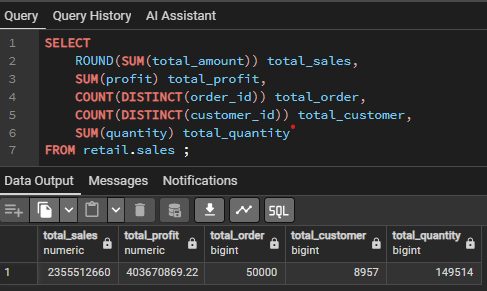
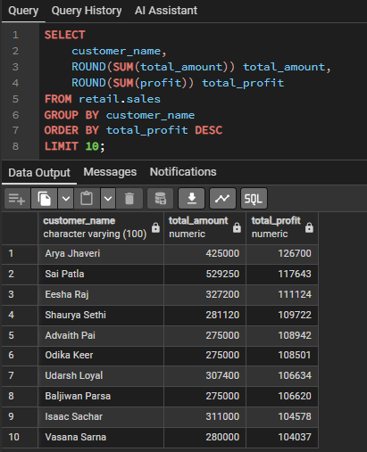

# 📊 Retail Sales Analysis using PostgreSQL & Tableau

## 📌 Project Overview

This project analyzes retail sales transactions using PostgreSQL and visualizes business performance through an interactive Tableau dashboard.

The objective of this project is to gain insights into sales trends, customer behavior, product performance, profitability, and return analysis to support business decision-making.

---

## 🎯 Business Objectives

- Analyze sales performance
- Identify top-performing products
- Evaluate customer purchasing behavior
- Monitor sales trends over time
- Analyze product return rates
- Compare payment methods
- Identify top customers

---

## 🛠️ Tools

- PostgreSQL
- SQL
- pgAdmin 4
- Tableau
- GitHub

---

## 📂 Dataset

The dataset contains retail transaction records including:

- Orders
- Customers
- Products
- Categories
- States
- Payment Methods
- Profit
- Quantity
- Discount
- Customer Rating
- Returned Orders

Download Dataset here :
- [RetailIQ_PowerBI.csv](dataset/RetailIQ_PowerBI.csv)
---

## 📊 Key Performance Indicators (KPI)

- Total Sales
- Total Profit
- Total Orders
- Total Customers
- Total Quantity


  

## 📊 Customer Analysis
## Top 10 Customer By Profit




## 📈 Dashboard

Dashboard includes:

- KPI Cards
- Sales by State
- Top 5 Products
- Sales by Payment Method
- Monthly Sales & Profit Trend
- Top Customers
- Interactive Filters

<p align="center">
  
</p>
---

## 💡 Key Insights

- Laptop generated the highest sales revenue.
- Maharashtra recorded the highest sales.
- March recorded the highest monthly sales.
- Sai Patla was the top customer by revenue.
- Electronics generated the highest sales.
- Karnataka had the highest return rate.

---

## 📁 Project Structure

```text
SQL-Retail-Sales-Analysis/
│
├── Image/
├── dashboard/
├── dataset/
├── sql/
└── README.md
```

---

## 🚀 Skills Demonstrated

- SQL Queries
- Common Table Expressions (CTE)
- Window Functions
- Aggregate Functions
- Business Analysis
- KPI Development
- Tableau Dashboard Design
- Data Visualization

---
## 📌 Business Recommendations

Based on the analysis, the following recommendations can help improve business performance:

- Increase inventory and marketing efforts for high-performing products such as **Laptop**, as they generate the highest revenue and profit.
- Investigate the high return rate in **Karnataka** to identify issues related to product quality, delivery, or customer expectations.
- Develop customer loyalty programs targeting high-value customers to encourage repeat purchases.
- Focus marketing campaigns on customers aged **30–39**, as they contribute the highest sales and profit.
- Improve sales strategies for low-performing products through promotions or product bundling.
- Monitor product return trends regularly to reduce return rates and improve customer satisfaction.

## 👨‍💻 Author

**Ricky Christian Simatupang - Palembang, Indonesia**

Aspiring Data Analyst

LinkedIn: https://www.linkedin.com/in/ricky-simatupang/

GitHub: https://github.com/rickychristian20
